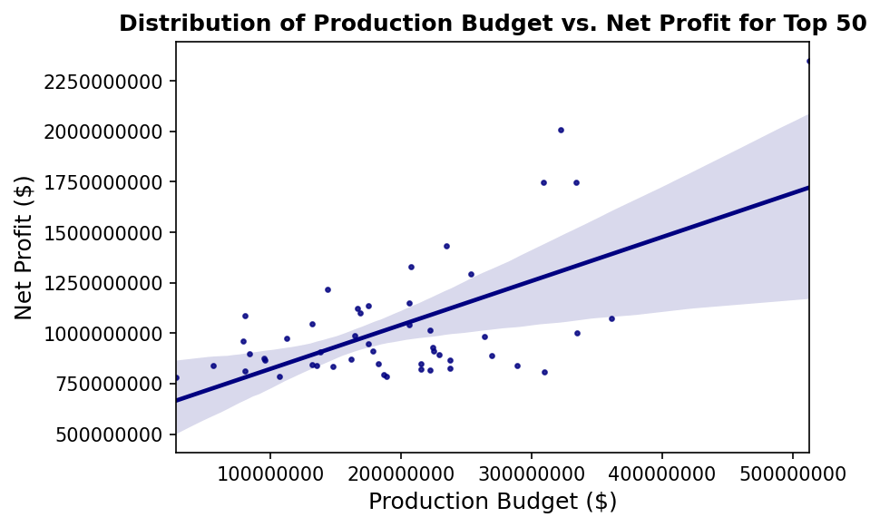
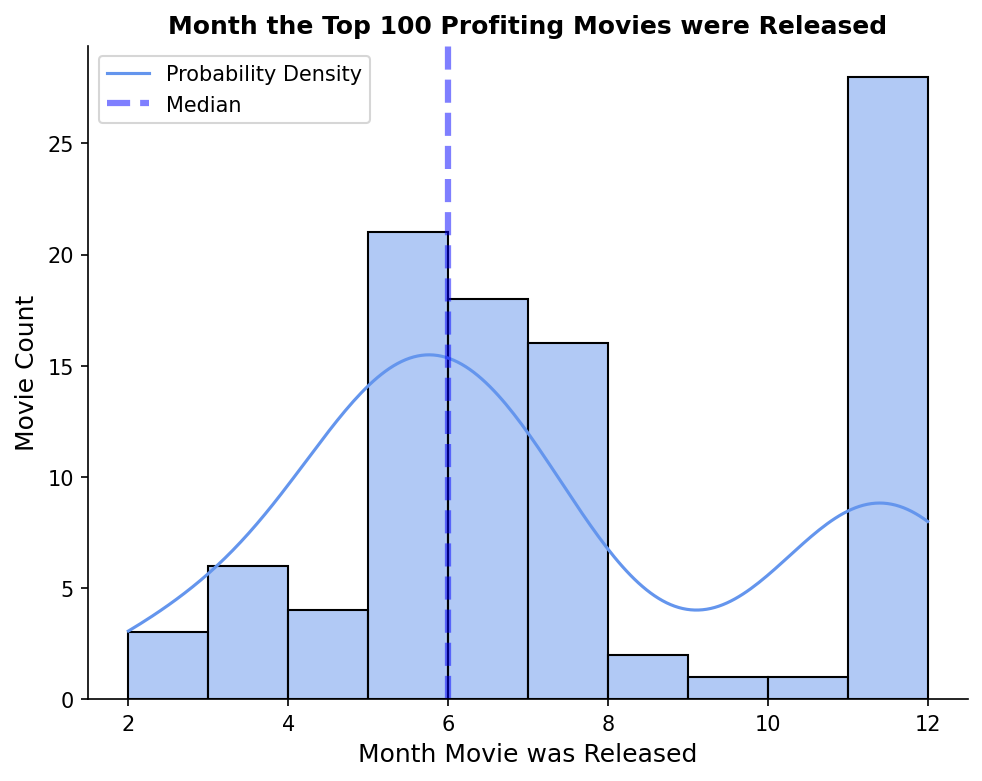
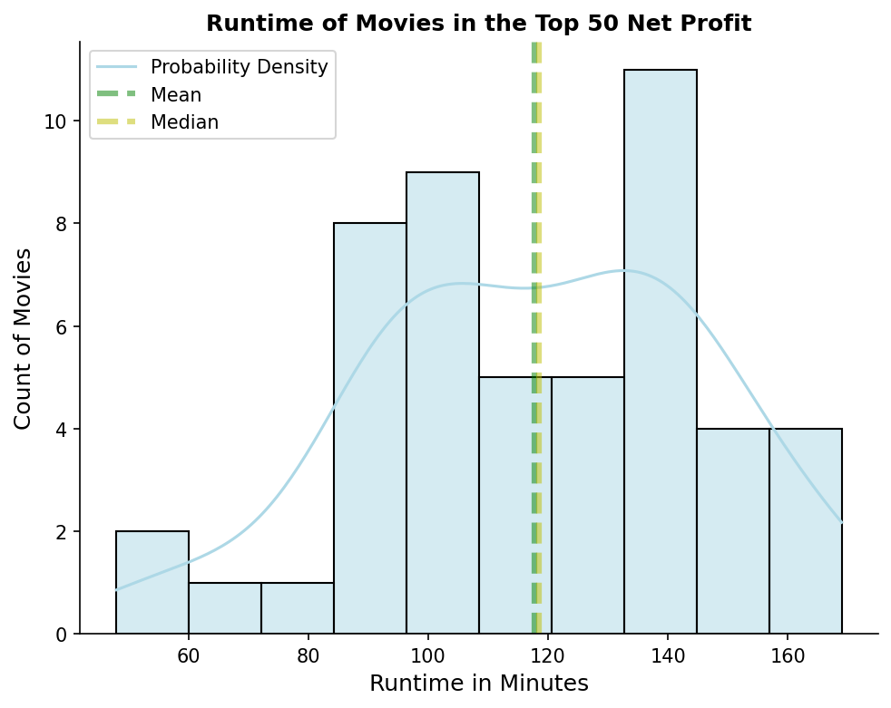

# Microsoft Movie Recommendation


**Author**: Rachel Fein
 

## Overview
This analysis and data modeling was performed with the intent to give recommendations to Microsoft on basic key characteristics their new movie should have to be successful. Success in this analysis is based on net profit (production budget - gross worldwide profit). The investigation used descriptive analysis and dove into the runtime, release month, and production budget of the most successful movies of all time.  

## Business Problem

Microsoft has entered the movie industry and wants to make a movie that has the highest chances of success. This analysis produced recommendations on what Microsoft’s movie runtime, release month, and budget should be to help land its movie among the top producing movies of all time.

## Data

The data for this analysis is from IMDb and The Numbers (TN), two reputable online movie database websites.  The IMDb data set that was used consisted of the columns: `release date`, `movie`, `production_budget`, `domestic_gross`, `worldwide_gross`. The TN dataframe that was used consisted of the columns: `primary_title`, `original_title`, `start_year`, `runtime_minutes`, `genres`. These two datasets were joined on `movie` and `primary_title`. The data from these sources worked well in my analysis since most movies located in the TN data frame were located in the IMDb data frame, this allowed for the databases to be combined when needed for analysis.

## Methods

This project used descriptive analysis, which included comparing specific data to find trends among the top net profiting movies. The IMDb & TN data was normalized, adjusted for inflation, merged with each other, and cleaned of unnecessary columns to prepare for data modeling. 

Data Modeling was performed with displots, regplots, and a styled table to visually show where the recommendations on runtime, release month, and budget comes from. The methods of analysis helped pinpoint common trends among the most successful movies.

## Results

The data investigation led to findings on common trends the most successful movies have. Pinpointing these trends can help Microsoft make educated decisions on their movie's characteristics: runtime, release month, and budget. The recommendations were ultimately found by interpreting the median values for each specific characteristic for the top 50 movies.

It is expected the higher the production budget the higher the net profit will be.



Most successful movies are released around June.



The movie should last approximately 117 to 119 minutes.




## Conclusions

This analysis used net profit as the measurement of success for a movie. After evaluating net profit in comparison to runtime, release month, and runtime this analysis has led to three recommendations: 
- The movie should last approximately 117 to 119 minutes
- The movie should be released in June
- It is expected the higher the production budget the higher the net profit will be. I recommend Microsoft spend around $188,000,000 which is the median production budget of the top 50 movies. 

## Next Steps

The analysis completed could be further improved by looking deeper into the production budget. Further analysis into budget will allow the client to get more detailed advice to which will help guarantee their movies success. For example, budget put towards special effects or marketing might have a greater impact than the budget spent on the talent/actors and these aspects would be a good starting point for further investigation.

Other analysis that could been completed that would have further answer the business problem would be on the movie genres. An analysis on genre can show insight on if specific genres lead to higher net profiting movies. 

## For More Information

See the full analysis here: [Jupyter Notebook](./Microsoft-Movie-Recommendations.ipynb) or review the presentation: [presentation](./Microsoft_Movie_Presentation.pdf).

## Repository Structure

```
├── data
├── images
├── Microsoft-Movie-Recommendations.ipynb
├── Microsoft_Movie_Presentation.pdf
└── README.md
```

